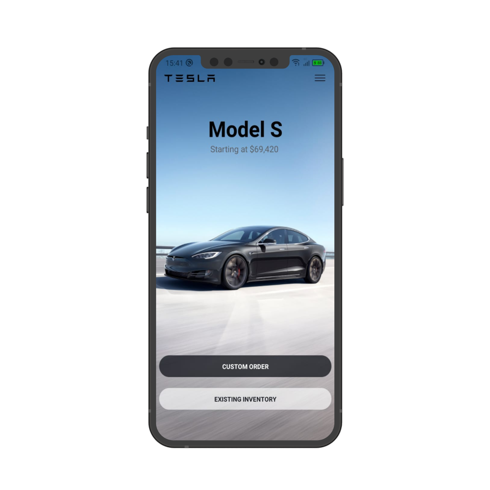

## Clone UI Tesla 🚗

Uma UI Clone para melhorar o aprendizado de React Native, utilização de componentes e tipagem de dados usando typescript 😅

## 💻 Projeto

O Clone UI Tesla têm como objetivo mostrar como é possível fazer uma UI elegante, como o do site da tesla, e ainda utilizar das melhores tecnologias do mercado para proporcionar
um benefício duplo tanto para o cliente quanto para o programador que acaba aprendendo mais sobre aplicações Mobile e Typescript.

## 👨‍💻 Tecnologias

- Rect Native
- Typescript
